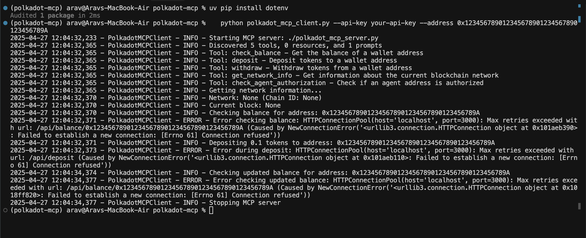

# Polkadot Model Context Protocol (MCP)

This project implements a [Model Context Protocol (MCP)](https://zencoder.ai/blog/model-context-protocol) server and client for interacting with Polkadot blockchain wallets. MCP is an open protocol that standardizes how applications provide context to large language models (LLMs), enabling them to interact with external systems through a common interface.

## Demo Video

Watch our comprehensive demo video explaining the project architecture, implementation details, and live demonstration of the MCP server in action.

## Project Walkthrough

In this detailed walkthrough, we explain:
- Project architecture and components
- Smart contract implementation
- Integration with Polkadot Asset Hub
- Live demonstration of all features
- Code structure and organization

## Screenshots

### MCP Server Interface

## Smart Contract Details

Our `AIWalletManager.sol` smart contract is deployed on Polkadot Asset Hub at:
[View Contract on Block Explorer](https://polkadot.js.org/apps/#/explorer/query/0xb79d0633B98285e2d19cfF8e139abe2F0b65d9Ff)

The contract implements:
- Secure wallet management for AI agents
- Role-based access control
- Event emission for all transactions
- Emergency pause functionality
- Upgradeable architecture
